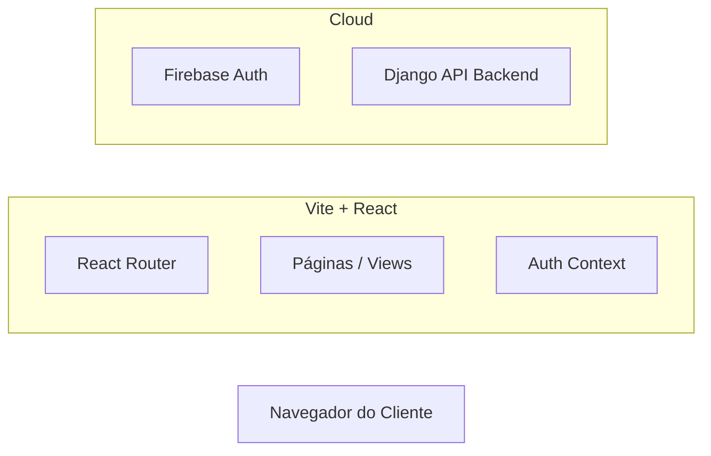

<div align="center">

# 💻 EasyRoute Web (Blue Harmony)
### Dashboard de Gestão Logística e WMS


</div>

---

## 📚 Sumário
- [🎯 Visão Geral](#-visão-geral-do-projeto)
- [🚀 Tecnologias Utilizadas](#-tecnologias-utilizadas)
- [✨ Funcionalidades](#-funcionalidades)
- [🏛️ Arquitetura](#-arquitetura-spa)
- [🛠️ Instalação e Configuração](#-instalação-e-configuração)
- [📂 Estrutura do Projeto](#-estrutura-do-projeto)

---

## 🎯 Visão Geral do Projeto

O **EasyRoute Web** (codinome *Blue Harmony*) é o painel de controle frontend para o sistema de gerenciamento de armazém. Construído como uma **Single Page Application (SPA)** de alta performance utilizando **Vite** e **React**, ele oferece uma experiência ágil para gestores logísticos.

O sistema consome a [Warehouse API](https://github.com/JoaoFlavio11/warehouse-api) para operações de dados e delega a gestão de identidade ao **Firebase Authentication**.

---

## 🚀 Tecnologias Utilizadas

| Categoria | Tecnologia | Badge |
| :--- | :--- | :--- |
| **Frontend Lib** | React 18+ |  |
| **Build Tool** | Vite |  |
| **Linguagem** | TypeScript |  |
| **Estilização** | Tailwind CSS |  |
| **Roteamento** | React Router DOM |  |
| **Auth** | Firebase Auth |  |
| **HTTP Client** | Axios / Fetch |  |

---

## ✨ Funcionalidades

### 🔐 Autenticação Segura
* Login, Registro e Recuperação de Senha.
* **Rotas Protegidas (`ProtectedLayout`):** Redirecionamento automático de usuários não autenticados.
* Persistência de sessão com Firebase.

### 📊 Dashboard Operacional
* Cards de métricas em tempo real.
* Gráficos de movimentação de estoque.
* Visualização interativa de "Veículos e Rotas".

### 📦 Gestão de WMS
* Listagem de Produtos e Inventário.
* Interface para criação de Pedidos.
* Visualização de Relatórios.

### ⚡ Performance DX
* **Hot Module Replacement (HMR)** instantâneo com Vite.
* Tipagem estrita com TypeScript para maior segurança no código.

---

## 🏛️ Arquitetura (SPA)

Diferente de frameworks SSR, aqui o cliente assume a renderização completa, comunicando-se via REST com o backend.


## 🛠️ Instalação e Configuração

### Pré-requisitos

  * Node.js 18+
  * NPM ou Yarn

### Passo a Passo

1.  **Clone o repositório**

    ```bash
    git clone [https://github.com/JoaoFlavio11/blue-harmony-warehouse](https://github.com/JoaoFlavio11/blue-harmony-warehouse)
    cd blue-harmony-warehouse
    ```

2.  **Instale as dependências**

    ```bash
    npm install
    ```

3.  **Configuração de Ambiente**
    Crie um arquivo `.env` na raiz do projeto (Vite usa o prefixo `VITE_`):

    ```env
    VITE_FIREBASE_API_KEY=sua_api_key
    VITE_FIREBASE_AUTH_DOMAIN=seu_projeto.firebaseapp.com
    VITE_FIREBASE_PROJECT_ID=seu_project_id
    VITE_FIREBASE_STORAGE_BUCKET=seu_bucket
    VITE_FIREBASE_MESSAGING_SENDER_ID=seu_sender_id
    VITE_FIREBASE_APP_ID=seu_app_id

    VITE_API_BASE_URL=http://localhost:8000/api
    ```

4.  **Rodar o servidor de desenvolvimento**

    ```bash
    npm run dev
    ```

    > O app estará disponível em: [http://localhost:5173](https://www.google.com/search?q=http://localhost:5173)

5.  **Build para Produção**

    ```bash
    npm run build
    ```

-----

## 📂 Estrutura do Projeto

A estrutura segue o padrão modular para React + Vite:

```plaintext
blue-harmony-warehouse/
├── public/             # Assets estáticos públicos
├── src/
│   ├── assets/         # Imagens e estilos globais
│   ├── components/     # Componentes UI reutilizáveis (Buttons, Cards)
│   ├── contexts/       # Context API (AuthContext, ThemeContext)
│   ├── hooks/          # Custom Hooks (useAuth, useFetch)
│   ├── layouts/        # Layouts de página (DashboardLayout, AuthLayout)
│   ├── pages/          # Páginas/Rotas (Login, Dashboard, Reports)
│   ├── services/       # Configuração do Firebase e API Service
│   ├── utils/          # Funções auxiliares e formatadores
│   ├── App.tsx         # Configuração de Rotas Principal
│   └── main.tsx        # Ponto de entrada (Entry point)
├── .env                # Variáveis de ambiente
├── tailwind.config.js  # Configuração do Tailwind
├── vite.config.ts      # Configuração do Vite
└── package.json
```
